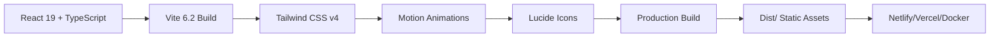
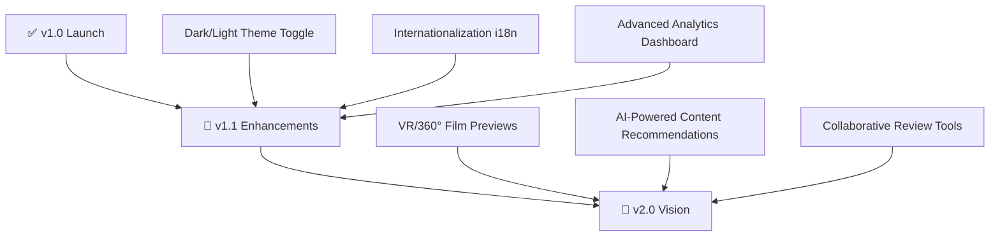

<div align="center">

<picture>
  <source media="(prefers-color-scheme: dark)" srcset="https://img.shields.io/badge/🎬_AURA_CINEMATIC-Premium_Portfolio-e5c158?style=for-the-badge&logo=film&logoColor=white&labelColor=0a0a0a">
  
</picture>

# ✦ AURA CINEMATIC ✦
### *Cinematic Documentary Portfolio*

<p align="center">
  <em>Award-Winning • Independent • Documentary • Production</em>
</p>

<br/>

[](https://react.dev/)
[](https://www.typescriptlang.org/)
[](https://vite.dev/)
[](https://tailwindcss.com/)
[](https://motion.dev/)
[](https://www.docker.com/)

<br/>

[🚀 Live Demo](#-live-demo) • [📦 Installation](#-installation) • [🎨 Design](#-design-system) • [🌐 Deploy](#-deployment) • [🐳 Docker](#-docker-support)

<hr style="border: 0; height: 1px; background: linear-gradient(90deg, transparent, #e5c158, transparent); margin: 2rem 0;">

</div>

---

## 🎬 Project Overview

<div align="center">

```diff
+ Where storytelling meets digital elegance.
```

</div>

**AURA CINEMATIC** is a premium editorial portfolio crafted for independent documentary production companies. This immersive, single-page application combines cinematic aesthetics with cutting-edge web technology to create a powerful hub for:

| 🎯 Purpose | ✨ Experience | 🚀 Performance |
|-----------|--------------|----------------|
| Client Acquisition | Obsidian Minimalist Design | Lightning-Fast Loads |
| Film Showcases | Immersive Hover Effects | Optimized Asset Loading |
| Subcultural Chronicles | Cinematic Lightboxes | SPA Navigation |
| Industry Networking | Keyboard-First UX | Production-Ready Build |

> *"A digital gallery that feels like walking through a film festival—every frame, every transition, every interaction designed to captivate."*

---

## ✨ Feature Spotlight

<div align="center">

| Feature | Description | Visual Cue |
|---------|-------------|------------|
| 🎥 **Editorial Filmography** | Advanced filtering, deep search, crew listings, ratings & reviews | `Dynamic Grid` |
| 🏔️ **Cinematic Hover FX** | Grayscale→Color transitions + subtle scale/zoom on project cards | `Smooth Motion` |
| 🎵 **Music Chronicles** | Dedicated section for acoustic geography & subcultural soundscapes | `Curated Collection` |
| 🍿 **Lightbox Cinema** | Full-screen video overlays for showreels, Vimeo & YouTube | `Seamless Playback` |
| ⚡ **Animated Stats** | CountUp counters + interactive studio timeline | `Living Data` |
| 📩 **Smart Inquiry Builder** | Tailored contact forms for partners, buyers & festival scouts | `Context-Aware` |
| 🎹 **Keyboard Navigation** | Shortcuts: `H`ome, `W`ork, `M`usic, `A`bout, `C`ontact, `?` Help | `Power User Ready` |

</div>

### ⌨️ Keyboard Shortcuts Reference

<div align="center">

| Key | Action | Icon |
|-----|--------|------|
| `H` | Navigate to Home | 🏠 |
| `W` | Browse Selected Work | 🎬 |
| `M` | Explore Music Docs | 🎵 |
| `A` | View About / Timeline | ℹ️ |
| `C` | Open Contact Form | ✉️ |
| `?` | Toggle Help Overlay | ❓ |
| `Esc` | Close Modals / Lightboxes | ✕ |

</div>

---

## 🛠️ Technical Architecture



### Core Dependencies

| Package | Version | Purpose |
|---------|---------|---------|
| `react` | `^19.0.0` | UI Framework |
| `typescript` | `^5.8.0` | Type Safety |
| `vite` | `^6.2.0` | Build Tooling |
| `tailwindcss` | `^4.0.0` | Utility-First Styling |
| `motion` | `^12.23.0` | Physics-Based Animations |
| `lucide-react` | `latest` | Consistent Iconography |

---

## 🎨 Design System

<div align="center">

### Color Palette

<table>
  <tr>
    <td align="center" style="background:#0a0a0a; color:#f2f2f2; padding:1rem; border-radius:8px;">
      <strong>Obsidian</strong><br/>
      <code>#0a0a0a</code><br/>
      <em>Primary Background</em>
    </td>
    <td align="center" style="background:#f2f2f2; color:#0a0a0a; padding:1rem; border-radius:8px;">
      <strong>Ice Silver</strong><br/>
      <code>#f2f2f2</code><br/>
      <em>Primary Text</em>
    </td>
    <td align="center" style="background:#e5c158; color:#0a0a0a; padding:1rem; border-radius:8px;">
      <strong>Cinematic Gold</strong><br/>
      <code>#e5c158</code><br/>
      <em>Accent & Highlights</em>
    </td>
  </tr>
</table>

### Typography Stack

```font
Headings:    'Inter Tight', system-ui    → Bold, Spaced, Impactful
Labels:      'JetBrains Mono', monospace → Technical, Precise, Sharp
Body:        'Inter', system-ui          → Readable, Clean, Versatile
```

### Motion Principles

- **Duration**: `700ms` cinematic ease for major transitions
- **Easing**: `cubic-bezier(0.4, 0, 0.2, 1)` for natural motion
- **Hover**: Subtle scale (`1.02x`) + grayscale→color reveal
- **Scroll**: Parallax-lite effects on hero sections

</div>

---

## 🚀 Installation & Development

### Prerequisites
```bash
# Node.js v18.x or higher
node -v  # >= v18.0.0

# npm or yarn package manager
npm -v   # >= 9.0.0
```

### Quick Start

```bash
# 1️⃣ Clone the repository
git clone https://github.com/your-username/aura-cinematic-portfolio.git
cd aura-cinematic-portfolio

# 2️⃣ Install dependencies
npm install

# 3️⃣ Start development server
npm run dev

# ✨ Server runs at → http://localhost:3000
```

### Available Scripts

| Command | Description | Output |
|---------|-------------|--------|
| `npm run dev` | Launch Vite dev server with HMR | `localhost:3000` |
| `npm run build` | Production build with optimizations | `dist/` folder |
| `npm run preview` | Preview production build locally | `localhost:4173` |
| `npm run lint` | Run ESLint + TypeScript checks | Terminal output |
| `npm run typecheck` | Strict TypeScript compilation | Type errors |

---

## 📁 Project Blueprint

```
aura-cinematic-portfolio/
│
├── 📦 public/
│   ├── favicon.ico
│   ├── robots.txt
│   └── _redirects          # SPA routing support
│
├── 📁 src/
│   ├── 🧩 components/      # Reusable UI atoms & molecules
│   │   ├── ImageWithFallback.tsx
│   │   ├── Lightbox.tsx
│   │   ├── VideoModal.tsx
│   │   ├── CountUp.tsx
│   │   ├── Navbar.tsx
│   │   ├── Footer.tsx
│   │   ├── ScrollProgress.tsx
│   │   ├── ScrollToTop.tsx
│   │   └── KeyboardShortcutsHelp.tsx
│   │
│   ├── 🖼️ pages/           # Route-level views
│   │   ├── Home.tsx
│   │   ├── SelectedWork.tsx
│   │   ├── MusicDocs.tsx
│   │   ├── About.tsx
│   │   └── Contact.tsx
│   │
│   ├── 🗂️ types.ts         # TypeScript interfaces & schemas
│   ├── 🗄️ data.ts          # Filmography, stats, metadata
│   ├── 🎨 index.css        # Global styles & Tailwind imports
│   └── ⚡ main.tsx         # Application entry point
│
├── ⚙️ vite.config.ts       # Build configuration
├── 📦 package.json         # Dependencies & scripts
├── 🐳 Dockerfile           # Multi-stage production image
├── 🌐 nginx.conf          # Optimized static file serving
└── 📄 README.md           # You are here ✨
```

---

## 🌐 Deployment Guide

<div align="center">

### 🟢 One-Click Deploy Options

[](https://vercel.com/new/clone?repository-url=https://github.com/your-username/aura-cinematic-portfolio)
[](https://app.netlify.com/start/deploy?repository=https://github.com/your-username/aura-cinematic-portfolio)

</div>

### Platform-Specific Instructions

<details>
<summary><strong>🔷 Vercel (Recommended)</strong></summary>

```bash
# Automatic detection - no config needed
# Build Settings (auto-detected):
#   Framework Preset: Vite
#   Build Command: npm run build
#   Output Directory: dist
#   Install Command: npm install

# Optional: Add environment variables in Vercel dashboard
```

✅ **Pros**: Zero-config, preview deployments, edge functions ready  
✅ **Best for**: Rapid iteration, team collaboration, production hosting

</details>

<details>
<summary><strong>🔷 Netlify</strong></summary>

```bash
# Manual configuration:
# Build command: npm run build
# Publish directory: dist

# Add public/_redirects file:
/*    /index.html    200

# Optional: netlify.toml for advanced config
[build]
  command = "npm run build"
  publish = "dist"
```

✅ **Pros**: Form handling, serverless functions, split testing  
✅ **Best for**: Marketing sites, form-heavy applications

</details>

<details>
<summary><strong>🔷 GitHub Pages</strong></summary>

```bash
# 1. Install gh-pages
npm install -D gh-pages

# 2. Update vite.config.ts
export default defineConfig({
  base: '/aura-cinematic-portfolio/', // repo name
  // ...other config
})

# 3. Add to package.json
{
  "scripts": {
    "predeploy": "npm run build",
    "deploy": "gh-pages -d dist"
  }
}

# 4. Deploy
npm run deploy
```

✅ **Pros**: Free, integrated with GitHub, simple  
✅ **Best for**: Personal projects, open-source portfolios

</details>

---

## 🐳 Docker Support

### Production-Ready Containerization

```dockerfile
# Multi-stage build for minimal image size
# Stage 1: Build
FROM node:18-alpine AS builder
WORKDIR /app
COPY package*.json ./
RUN npm ci
COPY . .
RUN npm run build

# Stage 2: Serve
FROM nginx:alpine
COPY --from=builder /app/dist /usr/share/nginx/html
COPY nginx.conf /etc/nginx/conf.d/default.conf
EXPOSE 80
CMD ["nginx", "-g", "daemon off;"]
```

### Quick Docker Commands

```bash
# 🏗️ Build the image
docker build -t aura-cinematic:latest .

# 🚀 Run the container
docker run -d \
  --name aura-portfolio \
  -p 8080:80 \
  --restart unless-stopped \
  aura-cinematic:latest

# 🔍 View logs
docker logs -f aura-portfolio

# 🛑 Stop & cleanup
docker stop aura-portfolio && docker rm aura-portfolio
```

✅ **Benefits**: Consistent environments, easy scaling, production-optimized Nginx config with gzip, caching headers, and SPA routing support.

---

## 🧪 Testing & Quality

```bash
# Type checking
npm run typecheck

# Linting
npm run lint

# Build validation
npm run build

# Preview production build
npm run preview
```

### Browser Support

<div align="center">

| Chrome | Firefox | Safari | Edge | Mobile |
|--------|---------|--------|------|--------|
| ✅ 120+ | ✅ 115+ | ✅ 17+ | ✅ 120+ | ✅ iOS 16+, Android 13+ |

</div>

---

## 🗺️ Roadmap



---

## 🤝 Contributing

We welcome contributions that align with our cinematic vision!

```diff
+ How to Contribute:

1. 🍴 Fork the repository
2. 🌿 Create your feature branch: git checkout -b feature/AmazingCinematicFeature
3. 💫 Commit your changes: git commit -m '✨ Add amazing cinematic feature'
4. 📤 Push to the branch: git push origin feature/AmazingCinematicFeature
5. 🎬 Open a Pull Request with detailed description

+ Contribution Guidelines:
• Follow existing code style & TypeScript strict mode
• Add tests for new functionality
• Update documentation for user-facing changes
• Use semantic commit messages (feat:, fix:, docs:, etc.)
```

---

## 📜 License

<div align="center">

```
MIT License © 2024 AURA CINEMATIC

Permission is hereby granted, free of charge, to any person obtaining a copy
of this software and associated documentation files (the "Software"), to deal
in the Software without restriction, including without limitation the rights
to use, copy, modify, merge, publish, distribute, sublicense, and/or sell
copies of the Software, and to permit persons to whom the Software is
furnished to do so, subject to the following conditions:

The above copyright notice and this permission notice shall be included in all
copies or substantial portions of the Software.
```

[📄 View Full License](LICENSE)

</div>

---

## 📬 Connect & Support

<div align="center">

### Project Repository
[🔗 github.com/your-username/aura-cinematic-portfolio](https://github.com/your-username/aura-cinematic-portfolio)

### Production Demo
[🎬 Live Portfolio Showcase](https://aura-cinematic.vercel.app) *(Coming Soon)*

### Contact the Team
```email
hello@auracinematic.studio
```

</div>

<div align="center">

<br/>

<picture>
  <source media="(prefers-color-scheme: dark)" srcset="https://img.shields.io/badge/Built_With-❤️_&_Cinema-e5c158?style=for-the-badge&logo=film&logoColor=0a0a0a&labelColor=0a0a0a">
  
</picture>

<br/>

<sub>✦ Frame by frame, pixel by pixel, story by story ✦</sub>

</div>
