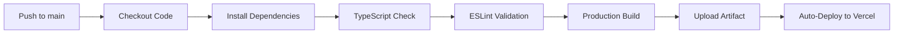

<div align="center">

<picture>
  <source media="(prefers-color-scheme: dark)" srcset="https://img.shields.io/badge/🎬_AURA_CINEMATIC-Editorial_Portfolio-e5c158?style=for-the-badge&logo=film&logoColor=0a0a0a&labelColor=0a0a0a">
  
</picture>

# ✦ AURA CINEMATIC ✦
### *High-End Editorial Documentary Portfolio Platform*

<p align="center">
  <em>Premium • Production-Ready • Obsidian Aesthetic • Cinematic UX</em>
</p>

<br/>

[](https://cinematic-documentary-portfolio.vercel.app/)
[](https://react.dev/)
[](https://www.typescriptlang.org/)
[](https://vite.dev/)
[](https://tailwindcss.com/)
[](https://motion.dev/)
[](https://www.docker.com/)
[](LICENSE)

<br/>

[🚀 Quick Start](#-quick-start) • [🎨 Design](#-design-system) • [🛠️ Tech](#-technical-stack) • [📁 Structure](#-project-structure) • [🌐 Deploy](#-deployment) • [🐳 Docker](#-containerization)

<hr style="border: 0; height: 1px; background: linear-gradient(90deg, transparent, #e5c158, #38bdf8, #e5c158, transparent); margin: 2.5rem 0;">

</div>

<!-- TABLE OF CONTENTS -->
<details open>
  <summary><strong>📑 Navigate This Document</strong></summary>
  <br/>
  <ol>
    <li><a href="#-architectural-overview">🎞️ Architectural Overview</a></li>
    <li><a href="#-core-features--ux-mechanics">✨ Core Features & UX Mechanics</a></li>
    <li><a href="#-mathematical-layout--viewport-dynamics">📐 Mathematical Layout & Viewport Dynamics</a></li>
    <li><a href="#-technical-stack--specifications">🛠️ Technical Stack & Specifications</a></li>
    <li><a href="#-project-structure">📁 Project Structure</a></li>
    <li><a href="#-quick-start">🚀 Quick Start</a></li>
    <li><a href="#-deployment">🌐 Production Deployment</a></li>
    <li><a href="#-containerization--nginx-architecture">🐳 Containerization & Nginx Architecture</a></li>
    <li><a href="#-ci-cd-pipeline">🔄 CI/CD Pipeline</a></li>
    <li><a href="#-license--contact">📜 License & Contact</a></li>
  </ol>
</details>

---

## 🎞️ Architectural Overview

<div align="center">

```diff
+ Where cinematic storytelling meets engineered precision.
```

</div>

**AURA CINEMATIC** is a high-performance Single Page Application engineered to mirror the visual weight and narrative depth of physical film festival lookbooks. Built on **React 19**, **TypeScript 5.8**, and **Vite 6**, the system prioritizes:

| Pillar | Description | Implementation |
|--------|-------------|----------------|
| **🎨 Obsidian Aesthetic** | Maximum contrast layout for visual media prominence | Deep black (`#0a0a0a`) + Ice silver (`#f2f2f2`) + Gold accents (`#e5c158`) |
| **🧩 Component Decoupling** | Separation of structural layouts from relational content | Static collections via `src/data.ts` with typed schemas |
| **⚡ Instant Asset Presentation** | Zero-layout-shift loading with optimized media pipelines | GPU-accelerated CSS, lazy loading, responsive srcsets |
| **🎯 Responsive Fluid Grids** | Adaptive layouts across unpredictable viewports | CSS Container Queries + dynamic aspect-ratio calculations |

---

## ✨ Core Features & UX Mechanics

<div align="center">

| Feature | Technical Implementation | User Experience |
|---------|-------------------------|-----------------|
| **🎛️ Multilayered Content Sorting** | Client-side filtering across `category`, `tags`, `director` fields | Instant search across synopses, titles, crew metadata |
| **🏔️ Grayscale→Color Hover FX** | GPU-accelerated `filter: grayscale(1) → grayscale(0)` + `scale(1.03)` | Cinematic 700ms shutter-like reveal on project cards |
| **🍿 Full-Screen Lightboxes** | State-trapped overlays with focus management | Seamless YouTube/Vimeo playback without route resets |
| **⌨️ Keyboard Navigation** | Global `keydown` listeners with spatial mapping | Power-user shortcuts: `H`ome, `W`ork, `M`usic, `A`bout, `C`ontact, `?` Help |
| **⚡ CountUp Statistics** | `requestAnimationFrame`-driven numerical interpolation | Smooth animated counters for films, awards, countries |
| **📩 Smart Inquiry Builder** | Multi-step form with conditional field rendering | Tailored contact flows for distributors, festivals, partners |

</div>

### ⌨️ Keyboard Shortcuts Reference

<div align="center">

| Key | Action | Visual Feedback |
|-----|--------|----------------|
| `H` | Navigate to **Home** | Smooth scroll to hero section |
| `W` | Open **Selected Work** | Filter grid with fade transition |
| `M` | Load **Music Chronicles** | Audio-themed layout swap |
| `A` | Display **About/Timeline** | Animated vertical chronicle |
| `C` | Focus **Contact Form** | Form field highlight + scroll |
| `?` | Toggle **Help Overlay** | Modal with shortcut legend |
| `Esc` | Close modals/lightboxes | Focus return + fade exit |

</div>

---

## 📐 Mathematical Layout & Viewport Dynamics

To preserve strict formatting symmetry across unpredictable browser viewports, fluid media grid dimensions compute dynamically using aspect-ratio preservation algorithms.

### Aspect Ratio Calculation

$$A_r = \frac{W_{\text{viewport}}}{H_{\text{viewport}}}$$

### Grid Dimension Formula

$$G_d = \left( \sum_{i=1}^{n} P_i \cdot C_{\text{factor}} \right) + \Delta_{\text{padding}}$$

**Where:**
| Variable | Description | Example Value |
|----------|-------------|---------------|
| $P_i$ | Baseline aspect scale of portfolio slot | `16:9`, `4:3`, `1:1` |
| $C_{\text{factor}}$ | Dynamic scaling from CSS container queries | `0.8` – `1.2` |
| $\Delta_{\text{padding}}$ | Visual whitespace buffer | `2rem` responsive |

### Responsive Breakpoints

```css
/* Tailwind v4 container query approach */
@container (min-width: 768px) {
  .project-grid { grid-template-columns: repeat(2, 1fr); }
}
@container (min-width: 1280px) {
  .project-grid { grid-template-columns: repeat(3, 1fr); }
}
```

---

## 🛠️ Technical Stack & Specifications

<div align="center">

### Core Architecture

| Tier | Technology | Purpose | Version |
|:-----|:-----------|:--------|:--------|
| **Framework** | [React](https://react.dev/) | UI Component Model | `19.0.0` |
| **Language** | [TypeScript](https://www.typescriptlang.org/) | Type Safety & DX | `5.8` |
| **Build Tool** | [Vite](https://vite.dev/) | Dev Server + Bundling | `6.2` |
| **Styling** | [Tailwind CSS](https://tailwindcss.com/) | Utility-First Design | `v4.0` |
| **Animations** | [Motion](https://motion.dev/) | Physics-Based Motion | `12.23` |
| **Icons** | [Lucide React](https://lucide.dev/) | Consistent Iconography | `latest` |

### Deployment & Infrastructure

| Service | Role | Configuration |
|---------|------|---------------|
| **Vercel** | Primary Hosting | Auto-detected Vite build, edge caching |
| **Docker** | Containerization | Multi-stage build, Nginx serving |
| **Nginx** | Static Asset Server | SPA routing, gzip, cache headers |
| **GitHub Actions** | CI/CD | Typecheck, lint, build, deploy |

</div>

---

## 📁 Project Structure

```
cinematic-documentary-portfolio/
│
├── 📦 public/
│   ├── favicon.ico
│   ├── robots.txt
│   └── _redirects          # SPA client-side routing support
│
├── 📁 src/
│   ├── 🧩 components/      # Reusable UI primitives
│   │   ├── ImageWithFallback.tsx   # Lazy loader with placeholder states
│   │   ├── Lightbox.tsx            # Focus-trapped full-viewport overlay
│   │   ├── VideoModal.tsx          # YouTube/Vimeo embed handler
│   │   ├── CountUp.tsx             # RAF-driven animated counter
│   │   ├── Navbar.tsx              # Blur-backed translucent header
│   │   ├── Footer.tsx              # Semantic credentials footer
│   │   ├── ScrollProgress.tsx      # Linear top-bound progress indicator
│   │   ├── ScrollToTop.tsx         # Smooth viewport reset utility
│   │   └── KeyboardShortcutsHelp.tsx # Accessible shortcut legend modal
│   │
│   ├── 🖼️ pages/           # Route-level view components
│   │   ├── Home.tsx                # Hero showreel + featured projects
│   │   ├── SelectedWork.tsx        # Filterable grid with tag arrays
│   │   ├── MusicDocs.tsx           # Acoustic geography showcase
│   │   ├── About.tsx               # Interactive timeline + studio metrics
│   │   └── Contact.tsx             # Multi-step inquiry builder
│   │
│   ├── 🗂️ types.ts         # TypeScript interfaces & data schemas
│   ├── 🗄️ data.ts          # Single source of truth for filmography
│   ├── 🎨 index.css        # Global Tailwind imports + font configs
│   └── ⚡ main.tsx         # Application bootstrap + root render
│
├── ⚙️ vite.config.ts       # Build optimization + plugin config
├── 📦 package.json         # Dependencies + lifecycle scripts
├── 🐳 Dockerfile           # Multi-stage production container
├── 🌐 nginx.conf          # Optimized static serving + SPA routing
├── 🔧 .github/workflows/  # GitHub Actions CI/CD definitions
└── 📄 README.md           # You are here ✨
```

---

## 🚀 Quick Start

### Prerequisites

```bash
# Node.js LTS (v22.x recommended)
node -v  # >= v22.0.0

# Package manager
npm -v   # >= 10.0.0
# or
pnpm -v  # >= 9.0.0
```

### Installation Flow

```bash
# 1️⃣ Clone repository
git clone https://github.com/mohdali-dev/cinematic-documentary-portfolio.git
cd cinematic-documentary-portfolio

# 2️⃣ Install dependencies
npm install

# 3️⃣ Launch development server
npm run dev

# ✨ Access at → http://localhost:5173
```

### Available Scripts

| Command | Description | Output |
|---------|-------------|--------|
| `npm run dev` | Vite dev server with HMR | `localhost:5173` |
| `npm run build` | Production build with optimizations | `dist/` directory |
| `npm run preview` | Preview production build locally | `localhost:4173` |
| `npm run lint` | ESLint + TypeScript type checks | Terminal diagnostics |
| `npm run typecheck` | Strict TypeScript compilation | Type error report |

---

## 🌐 Production Deployment

<div align="center">

### 🟢 One-Click Deploy

[](https://vercel.com/new/clone?repository-url=https://github.com/mohdali-dev/cinematic-documentary-portfolio)

</div>

### Platform Configuration

<details>
<summary><strong>🔷 Vercel (Recommended)</strong></summary>
<br/>

```json
// vercel.json (auto-detected, optional overrides)
{
  "buildCommand": "npm run build",
  "outputDirectory": "dist",
  "installCommand": "npm install",
  "framework": "vite",
  "rewrites": [
    { "source": "/(.*)", "destination": "/index.html" }
  ]
}
```

✅ **Advantages**: Zero-config, preview deployments, edge functions, analytics  
✅ **Best For**: Production hosting, team collaboration, rapid iteration

</details>

<details>
<summary><strong>🔷 Netlify</strong></summary>
<br/>

```toml
# netlify.toml
[build]
  command = "npm run build"
  publish = "dist"

[[redirects]]
  from = "/*"
  to = "/index.html"
  status = 200
```

✅ **Advantages**: Form handling, serverless functions, split testing  
✅ **Best For**: Marketing sites, form-heavy applications

</details>

<details>
<summary><strong>🔷 GitHub Pages</strong></summary>
<br/>

```bash
# Install gh-pages utility
npm install -D gh-pages

# Update vite.config.ts
export default defineConfig({
  base: '/cinematic-documentary-portfolio/', // repository name
  // ...other config
})

# Add to package.json scripts
{
  "predeploy": "npm run build",
  "deploy": "gh-pages -d dist"
}

# Deploy
npm run deploy
```

✅ **Advantages**: Free, GitHub-integrated, simple workflow  
✅ **Best For**: Personal projects, open-source portfolios

</details>

---

## 🐳 Containerization & Nginx Architecture

### Multi-Stage Docker Build

```dockerfile
# Stage 1: Build
FROM node:22-alpine AS builder
WORKDIR /app
COPY package*.json ./
RUN npm ci --omit=dev
COPY . .
RUN npm run build

# Stage 2: Serve
FROM nginx:alpine
COPY --from=builder /app/dist /usr/share/nginx/html
COPY nginx.conf /etc/nginx/conf.d/default.conf
EXPOSE 80
CMD ["nginx", "-g", "daemon off;"]
```

### Local Container Workflow

```bash
# 🏗️ Build the production image
docker build -t aura-cinematic:latest .

# 🚀 Run with port mapping
docker run -d \
  --name aura-portfolio \
  -p 8080:80 \
  --restart unless-stopped \
  aura-cinematic:latest

# 🔍 Stream logs
docker logs -f aura-portfolio

# 🛑 Cleanup
docker stop aura-portfolio && docker rm aura-portfolio
```

### Nginx Configuration Highlights

```nginx
server {
    listen 80;
    server_name localhost;

    # SPA routing support
    location / {
        root /usr/share/nginx/html;
        index index.html;
        try_files $uri $uri/ /index.html;
    }

    # Long-term caching for static assets
    location ~* \.(?:css|js|woff2?|eot|ttf|svg|png|jpe?g|gif|ico)$ {
        expires 6M;
        add_header Cache-Control "public, immutable, max-age=15552000";
        access_log off;
    }

    # Gzip compression for text-based assets
    gzip on;
    gzip_types text/plain text/css application/json application/javascript;
    gzip_min_length 1000;
}
```

✅ **Benefits**: Minimal image size, production-optimized caching, SPA routing support, gzip compression

---

## 🔄 CI/CD Pipeline

### GitHub Actions Workflow (`.github/workflows/ci-cd.yml`)

```yaml
name: Integration and Deployment

on:
  push:
    branches: [ "main", "master" ]
  pull_request:
    branches: [ "main", "master" ]

jobs:
  quality-gate:
    runs-on: ubuntu-latest
    steps:
    - name: 📦 Checkout Repository
      uses: actions/checkout@v4

    - name: 🟢 Setup Node.js
      uses: actions/setup-node@v4
      with:
        node-version: 22
        cache: 'npm'

    - name: 📥 Install Dependencies
      run: npm ci

    - name: 🔍 Type Check
      run: npm run typecheck

    - name: 🧹 Lint Code
      run: npm run lint

    - name: 🏗️ Production Build
      run: npm run build

    - name: 📤 Upload Build Artifact
      uses: actions/upload-artifact@v4
      with:
        name: production-dist
        path: dist/
```

### Pipeline Stages



---

## 📜 License & Contact

<div align="center">

### License

```
MIT License © 2024 AURA CINEMATIC

Permission is hereby granted, free of charge, to any person obtaining a copy
of this software and associated documentation files (the "Software"), to deal
in the Software without restriction, including without limitation the rights
to use, copy, modify, merge, publish, distribute, sublicense, and/or sell
copies of the Software, and to permit persons to whom the Software is
furnished to do so, subject to the following conditions:

The above copyright notice and this permission notice shall be included in all
copies or substantial portions of the Software.
```

[📄 View Full License Text](LICENSE)

<br/>

### Connect

| Platform | Handle | Link |
|----------|--------|------|
| **GitHub** | `@mohdali-dev` | [github.com/mohdali-dev](https://github.com/mohdali-dev) |
| **LinkedIn** | `mohdali1` | [linkedin.com/in/mohdali1](https://www.linkedin.com/in/mohdali1) |
| **Hugging Face** | `mohdali1` | [huggingface.co/mohdali1](https://huggingface.co/mohdali1) |
| **Portfolio** | `mohdali.me` | [mohdali.me](https://www.mohdali.me) |

<br/>

<picture>
  <source media="(prefers-color-scheme: dark)" srcset="https://img.shields.io/badge/Built_With-❤️_&_Cinema-e5c158?style=for-the-badge&logo=film&logoColor=0a0a0a&labelColor=0a0a0a">
  
</picture>

<br/>

<sub>✦ Frame by frame • Pixel by pixel • Story by story ✦</sub>

</div>
